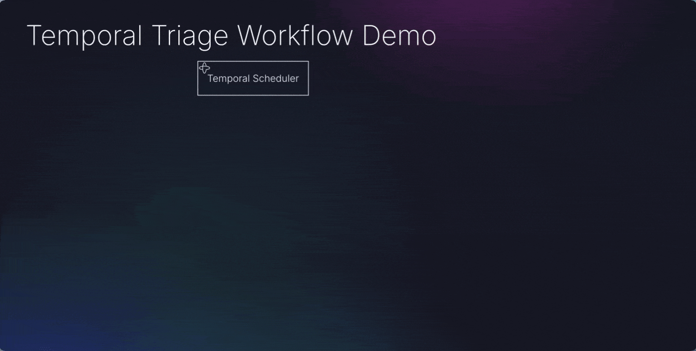

# Temporal Triage Workflow Demo - Docker Setup



## Prerequisites
- Docker and Docker Compose
- OpenAI API key

## Quick Start

1. Create `.env` file:
```bash
cp .env.example .env
# Edit .env and add your OPENAI_API_KEY
```

2. Start all services:
```bash
docker-compose up --build
```

3. Access the services:
- Dashboard: http://localhost:8001
- Triage API: http://localhost:8000/cases
- Temporal UI: http://localhost:8233
- Graph Service: http://localhost:6001/v1.0/me/messages/delta
- Account MCP: http://localhost:8002

## Services

- **temporal**: Temporal server with PostgreSQL
- **postgres**: Database for Temporal
- **graph_service**: Mock Microsoft Graph API (port 6001)
- **account_mcp**: Account status MCP service (port 8002)
- **triage_agent**: AI agent worker for email triage
- **triage_service**: Main workflow orchestrator (port 8000)
- **triage_dashboard**: Web UI (port 8001)

## Stop Services
```bash
docker-compose down
```

## Clean Up (including volumes)
```bash
docker-compose down -v
```
